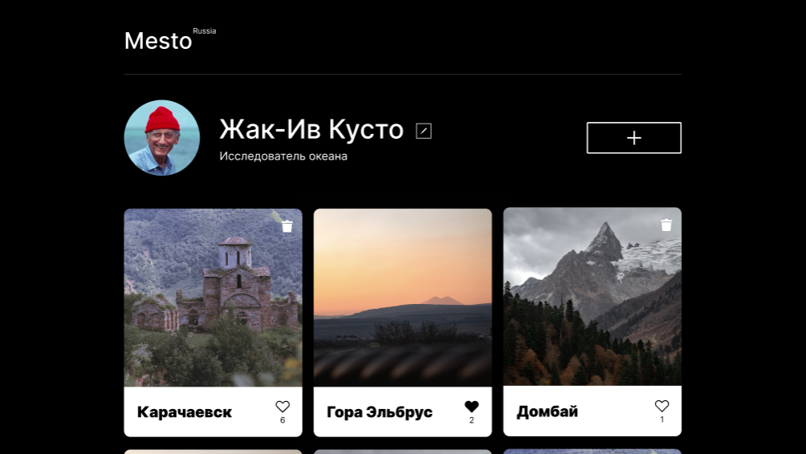

# Mesto: интерактивная галерея фотографий

Mesto - это одностраничное веб-приложение, позволяющее пользователям создавать персональную галерею фотографий. Основные возможности включают добавление и удаление карточек с изображениями, выставление/удаление лайков, редактирование профиля и просмотр фотографий в полноэкранном режиме.

[Ссылка на проект Mesto](https://violetta-zhukova.github.io/mesto-project-ff/)



## Стек

     

## Особенности реализации

- Модульная архитектура, разделение кода на переиспользуемые модули
- Интеграция с API (получение/изменение данных на сервере, работа с API через промисы)
- Валидация форм, использование регулярных выражений

## Установка и запуск

Для установки и запуска проекта необходимо выполнить команды

```
npm install
npm run dev
```

или

```
yarn
yarn dev
```
